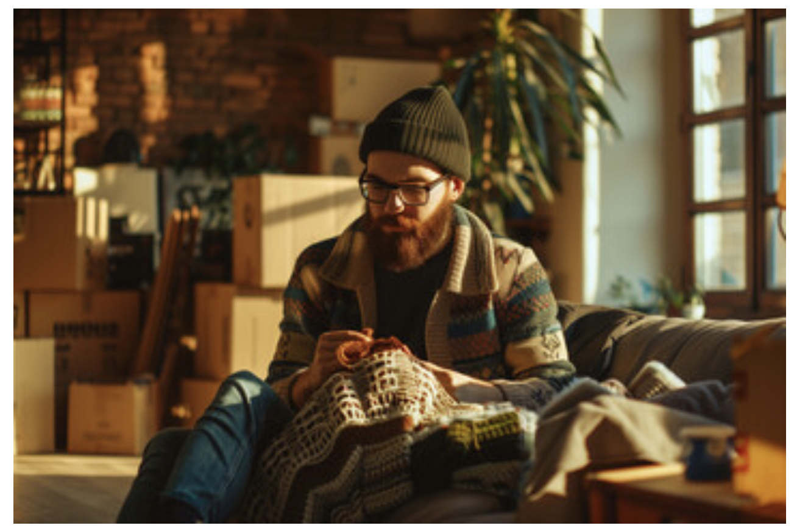
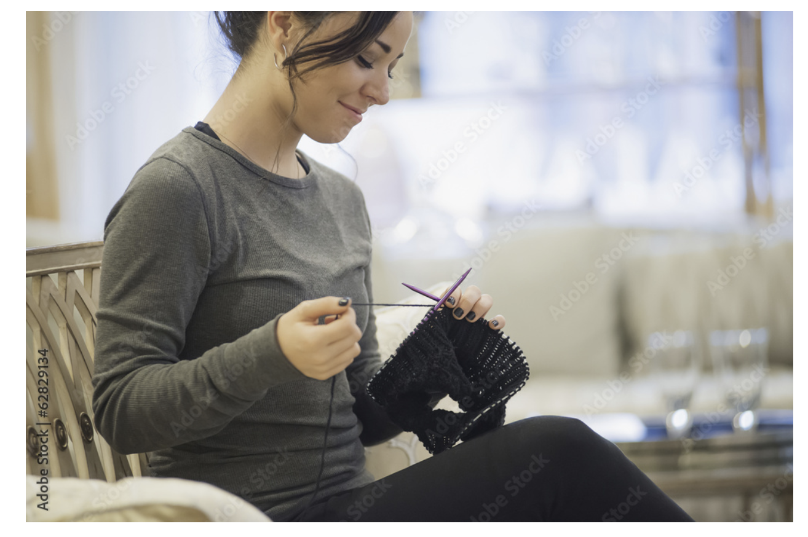

# Personas

**Aaron**

Age 28-year-old male living in Seattle WA

He works in a hybrid office space for a sustainable fashion company

Aaron lives in a busy city but works unique hours since he sometimes works from home.
He takes a mix of public transportation or takes his bike when the weather allows. While
on the bus/train, he likes to crochet to keep himself busy by doing his favorite hobby
crochet.

He recently has been wanting to make more of his own clothes since it has been hard to
find sweaters in his size and style at secondhand stores and online options are not
sustainable in his view. Most online patterns are not catered to his size and the process
of redoing the patterns by hand takes the joy out of what is normally relaxing, “If I
wanted to design my own clothes I would do that!”

Goals:
* Keep making sweaters
* Save the planet through sustainability
* Share his designs and patterns with people like himself
* Work at home and on the go

**Lily**

Age: 26 

Occupation: Marketing Coordinator

Lily is a young parent who loves using knitting as a creative outlet after long days of working and parenting. She has an active toddler at home, and she doesn’t always have time or energy to adjust patterns for her child’s growing size. She enjoys creating and personalized clothes and accessories such as hats and scarves. The manual calculation needed to do the resize patterns is too overwhelming after a busy day. She is hoping to find a tool that will help her do this process.

Goals:
* Improve skills 
* Save time on pattern Adjustments 
* Enjoy knitting as an outlet for long days of work

# Scenarios

**Scenario 1: “Aaron is snowed in”**

During one very intense snowstorm, Aaron becomes snowed in where he loses power and his wifi-connection making him unable to work that day. While he is able to get his power back on the wifi is still down, his boss tells him to just take the day for himself and take the day off. Aaron decides to curl up on the couch and watch a nature documentary from his extensive DVD collection. Aaron also pulls out his iPad and begins working on resizing a pattern he had downloaded so that he can start on a new project, “I might be stuck here awhile” he says looking out the window.

**Scenario 2: “Getting ready for winter”**

Winter is approaching and Lily wants to knit a cozy scarf for her toddler. She found a scarf pattern online but it’s sized for an adult and she only has a limited amount of yards leftover. She doesn’t have the time to go pick up more. She quickly opened her app and resized the pattern to ensure she had enough to knit a scarf for her toddler.

