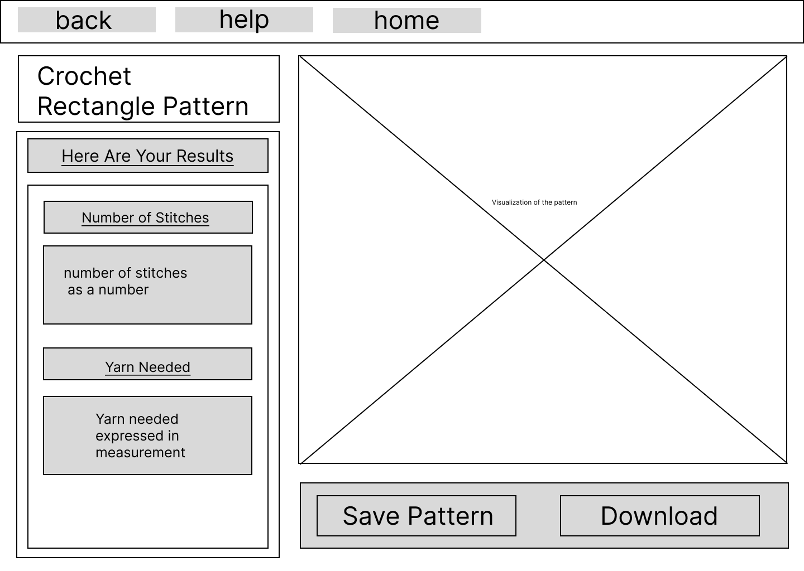
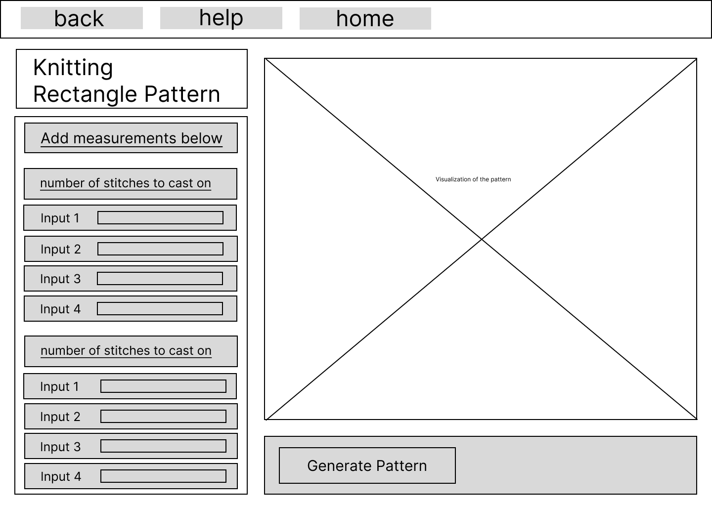
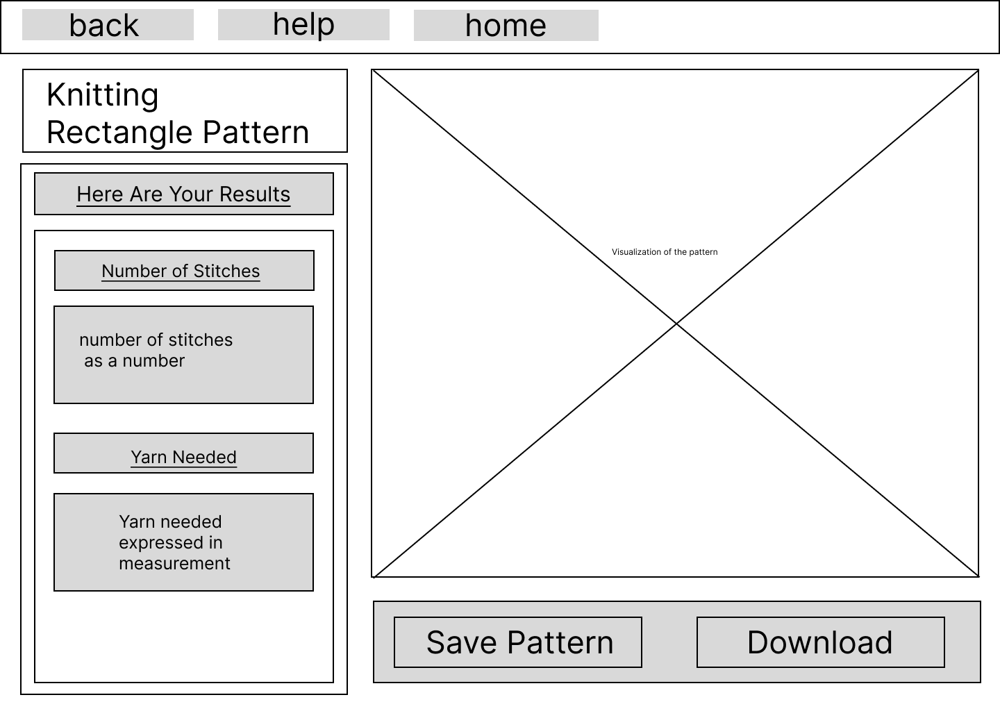
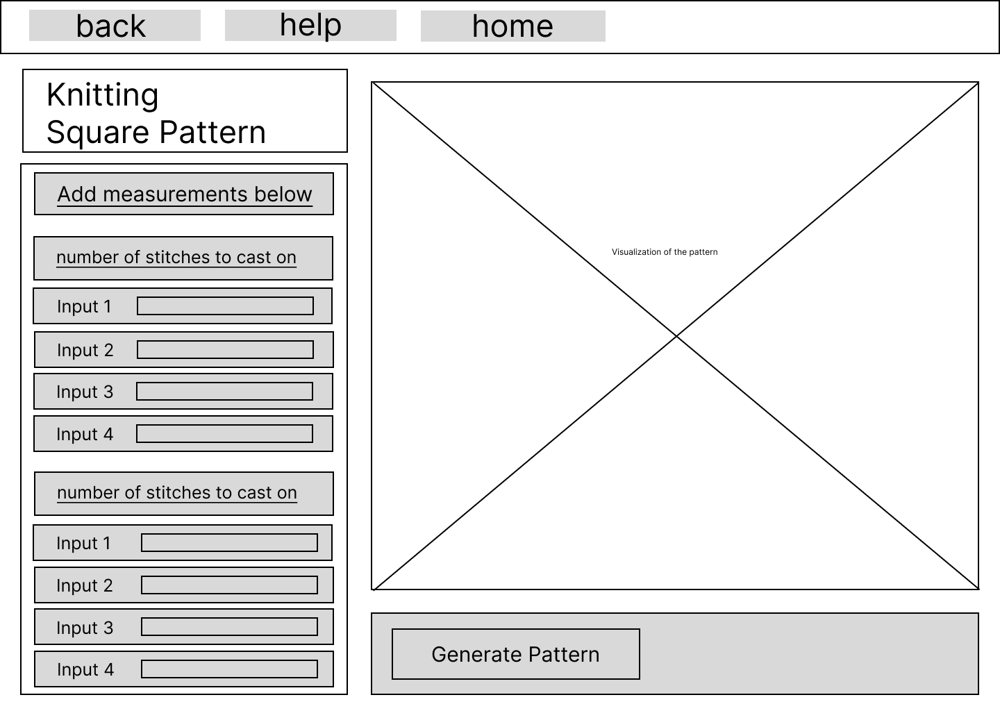
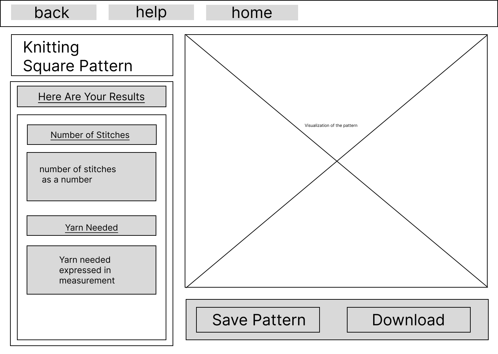
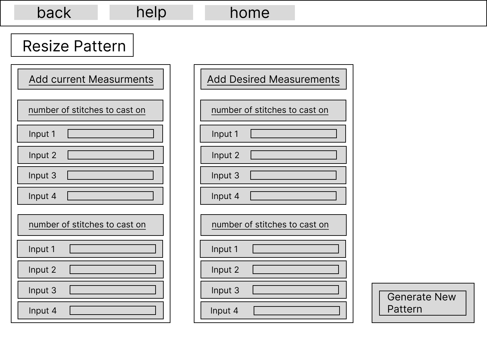
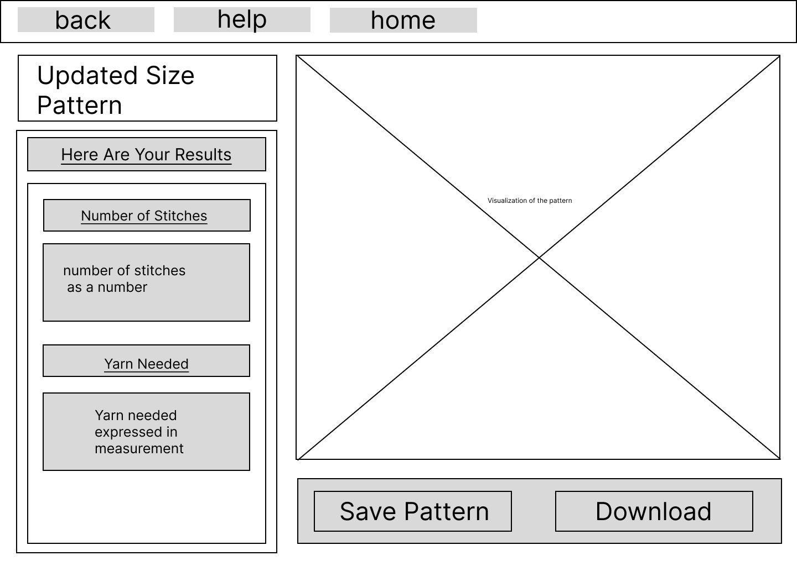
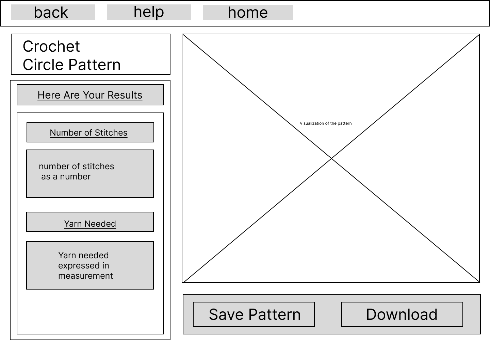

# Wireframes
Below is a list of all wireframes made to simulate the functionalities of the Stitch Niche application and prove a higher fidelity design artifact.

# Homescreen

# Help Page

# Crochet Rectangular Pattern

# Knitting Rectangular Pattern

# Crochet Square Pattern

# Knitting Square Pattern

# Resizing Patterns

# Crochet Angle Pattern

# Knitting Angle Pattern

# Crochet Circle Pattern
There will likely only be crochet for circle pattern since they are mostly utilized in making crochet plushies

